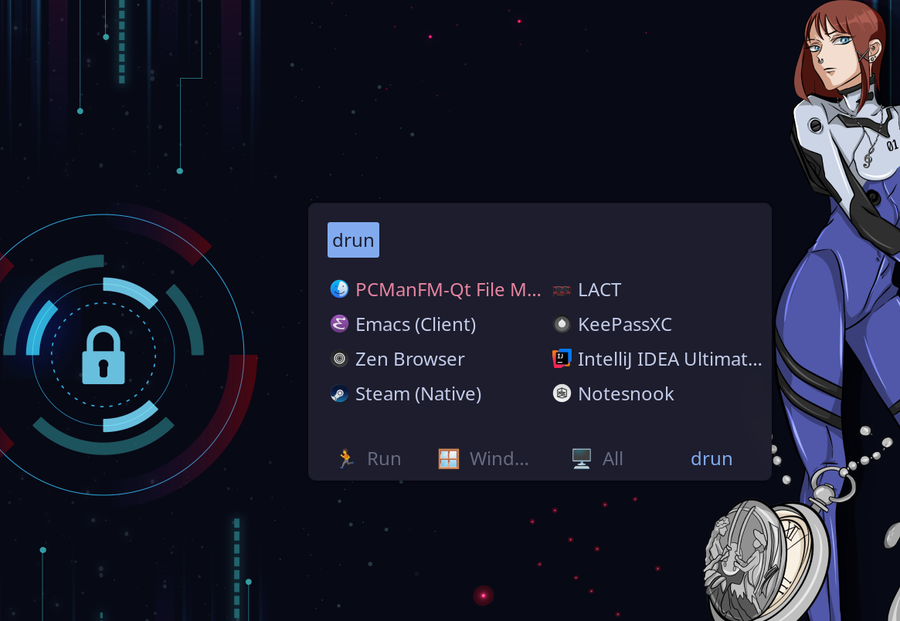
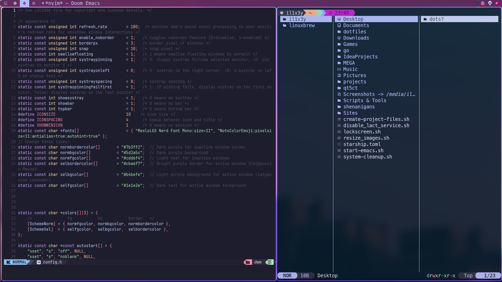
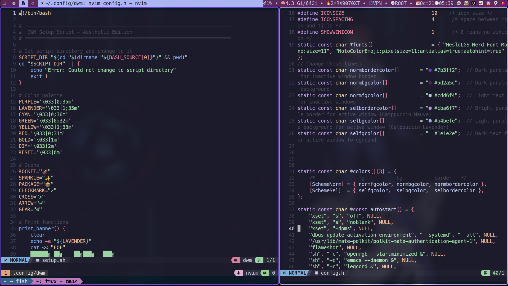
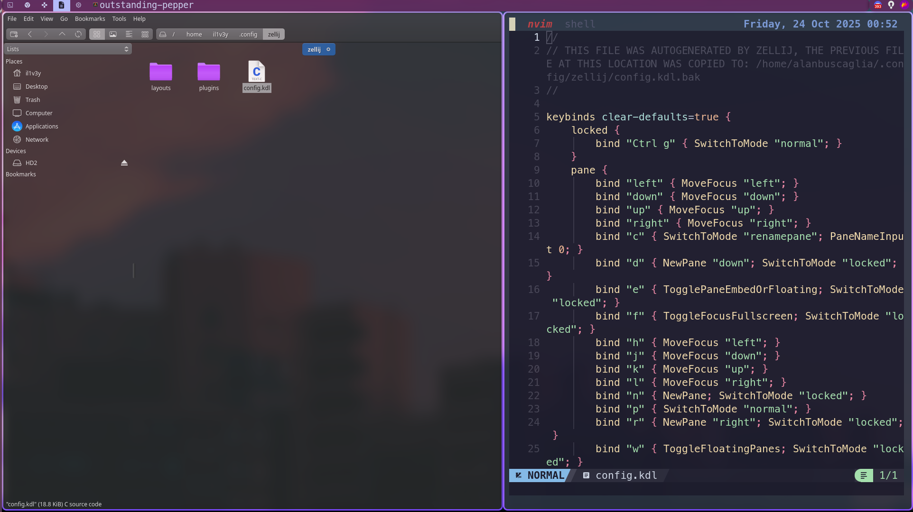

<div align="center">

# 🐧 Arch Linux Dotfiles


---

*My personal configuration files for Arch Linux featuring a customized DWM setup with modern terminal tools and development environments.*

</div>

## 📸 Preview

<div align="center">

### 🎬 Setup Showcase


https://github.com/user-attachments/assets/desktop.mp4


### 📸 Screenshots Gallery

<table>
  <tr>
    <td width="50%">
      
      <br/>
      <sub><b>🚀 Rofi Application Launcher</b></sub>
    </td>
    <td width="50%">
      
      <br/>
      <sub><b>💜 Doom Emacs + Yazi Integration</b></sub>
    </td>
  </tr>
  <tr>
    <td>
      
      <br/>
      <sub><b>🔧 Tmux + Neovim Workflow</b></sub>
    </td>
    <td>
      
      <br/>
      <sub><b>⚡ Zellij Terminal Workspace</b></sub>
    </td>
  </tr>
</table>

</div>

---

## ⚙️ System Information

- **OS:** Arch Linux (CachyOS)
- **Kernel:** 6.17.0-3-cachyos
- **WM:** DWM (Dynamic Window Manager)
- **Shell:** Fish / Zsh with Starship prompt
- **Terminal:** Kitty / Alacritty
- **Editor:** Neovim / Doom Emacs
- **Multiplexer:** Tmux

## 📦 Included Configurations

| Package | Category | Description | Installation |
|---------|----------|-------------|--------------|
| **Fish** | Shell | Modern shell with syntax highlighting and autosuggestions | `pacman` |
| **Zsh** | Shell | Powerful shell with Zinit plugin manager and Powerlevel10k | `pacman` |
| **Starship** | Shell Prompt | Fast, minimal, cross-shell prompt | `pacman` |
| **Kitty** | Terminal | GPU-accelerated terminal emulator with ligatures | `pacman` |
| **Alacritty** | Terminal | Blazing fast, OpenGL terminal emulator | `pacman` |
| **Tmux** | Multiplexer | Terminal multiplexer with TPM plugin manager | `pacman` |
| **DWM** | Window Manager | Suckless dynamic window manager (custom patches) | Manual (source included) |
| **Rofi** | Launcher | Application launcher and window switcher | `pacman` |
| **Picom** | Compositor | Lightweight compositor for transparency and effects | `pacman` |
| **Dunst** | Notifications | Lightweight notification daemon | `pacman` |
| **Neovim** | Editor | Hyperextensible Vim-based text editor | `pacman` |
| **Doom Emacs** | Editor | Configuration framework for Emacs | Git (manual install) |
| **Micro** | Editor | Modern terminal-based text editor | `pacman` |
| **Fastfetch** | System Info | Fast system information tool | `pacman` / AUR |
| **Btop** | Monitor | Beautiful resource monitor | `pacman` |
| **PCManFM-Qt** | File Manager | Lightweight Qt-based file manager with custom theme | `pacman` |
| **Yazi** | File Manager | Blazing fast terminal file manager (Rust) | AUR (`yazi-git`) |
| **Zellij** | Workspace | Modern terminal workspace with layout support | AUR |
| **Cava** | Visualizer | Console-based audio visualizer | `pacman` |
| **Flameshot** | Screenshots | Powerful screenshot tool | `pacman` |

### File Manager Setup

**PCManFM-Qt** is configured with:
- **Icon Theme:** McMojave-circle-purple-dark (matches DWM purple theme)
- **Terminal:** Kitty integration (`Super + e` to launch)
- **Thumbnails:** Enabled for image preview
- **Archiver:** file-roller for compressed files

Install the icon theme:
```bash
yay -S mcmojave-circle-icon-theme
```

### Qt Theme Configuration

For proper theming of Qt applications (PCManFM-Qt), you need **Kvantum** and **Qt5ct**:

**Required packages:**
```bash
sudo pacman -S kvantum qt5ct
yay -S kvmojave-kde-theme
```

**Configuration:**
1. **Kvantum Manager:**
   - Theme: `KvMojave#` (dark variant)
   - Applies Qt theming with transparency and blur effects

2. **Qt5 Settings (qt5ct):**
   - Style: `kvantum-dark`
   - Icon Theme: `McMojave-circle-purple-dark`
   - Color Scheme: `catppuccin-mocha-mauve`
   - Font: `JetBrains Mono, 9pt`

3. **Set environment variable** (add to your shell rc):
   ```bash
   export QT_QPA_PLATFORMTHEME=qt5ct
   ```

**After installation:**
- Run `kvantummanager` to select the KvMojave# theme
- Run `qt5ct` to verify fonts and icons
- Restart Qt applications for changes to take effect

### Scripts
- **lockscreen.sh** - Custom screen locking script with wallpaper support
- **lockscreen-setup.sh** - One-time setup for lockscreen wallpapers
- **install.sh** - Automated installation script with backups
- **bootstrap.sh** - One-line remote installation script

## ⚖️ Feature Comparisons

<details open>
<summary><b>🐚 Shell: Fish vs Zsh</b></summary>

<br>

| Feature | Fish | Zsh |
|---------|------|-----|
| **Syntax Highlighting** | Built-in, out of the box | Via plugin (zsh-syntax-highlighting) |
| **Auto-suggestions** | Built-in, based on history | Via plugin (zsh-autosuggestions) |
| **Configuration** | Simple, user-friendly syntax | Traditional shell scripting |
| **POSIX Compliance** | ❌ Not POSIX compliant | ✅ POSIX compliant |
| **Learning Curve** | Gentle, beginner-friendly | Steeper, more powerful |
| **Plugin Manager** | Fisher | Zinit |
| **Tab Completion** | Excellent, built-in | Excellent, highly customizable |
| **Startup Speed** | Very fast | Fast (with optimization) |
| **Scripting** | Fish script (different syntax) | Standard shell scripting |
| **Community** | Growing, modern | Large, established |
| **Best For** | Interactive use, beginners | Power users, scripting |

</details>

<details open>
<summary><b>💻 Terminal: Kitty vs Alacritty</b></summary>

<br>

| Feature | Kitty | Alacritty |
|---------|-------|-----------|
| **GPU Acceleration** | ✅ Yes | ✅ Yes |
| **Performance** | Excellent | Excellent |
| **Ligatures** | ✅ Full support | ✅ Full support |
| **Image Support** | ✅ Built-in protocol | ❌ No |
| **Multiplexing** | ✅ Built-in tabs/splits | ❌ Use tmux/zellij |
| **Configuration** | `kitty.conf` (custom format) | `alacritty.toml` (TOML) |
| **Startup Time** | Very fast | Blazing fast |
| **Extensibility** | Kittens (extensions) | Minimal by design |
| **Resource Usage** | Low | Very low |
| **Font Rendering** | Excellent | Excellent |
| **Scrollback** | Built-in | Limited (use tmux) |
| **Best For** | Feature-rich experience | Minimalist speed |

</details>

<details open>
<summary><b>✏️ Editor: Neovim vs Doom Emacs</b></summary>

<br>

| Feature | Neovim | Doom Emacs |
|---------|--------|------------|
| **Configuration Language** | Lua (modern) or Vimscript | Emacs Lisp |
| **Modal Editing** | ✅ Native (Vim keybindings) | ✅ Via Evil mode |
| **Plugin Ecosystem** | Large (Neovim/Vim plugins) | Massive (Emacs packages) |
| **Startup Time** | Very fast (~50ms) | Slower (~2-3s with daemon) |
| **Learning Curve** | Moderate to steep | Very steep |
| **LSP Support** | ✅ Built-in, excellent | ✅ Excellent via lsp-mode |
| **Org-mode** | ❌ Limited (orgmode.nvim) | ✅ Best-in-class |
| **Terminal Integration** | ✅ Excellent | ✅ Good (vterm, eshell) |
| **Git Integration** | Fugitive, LazyGit | Magit (best git interface) |
| **Resource Usage** | Very low | Moderate |
| **Extensibility** | High (Lua plugins) | Extremely high (Elisp) |
| **Configuration Framework** | LazyVim, NvChad, AstroNvim | Doom, Spacemacs |
| **Best For** | Fast editing, terminal workflow | Writing, org-mode, Lisp development |

</details>

## 🚀 Installation

### Quick Install (Recommended)

**One-line installation on a fresh Arch Linux system:**

```bash
bash <(curl -fsSL https://raw.githubusercontent.com/ind4skylivey/dotfiles-s1b/main/bootstrap.sh)
```

Or clone and run the installer:

```bash
git clone https://github.com/ind4skylivey/dotfiles-s1b.git ~/dotfiles
cd ~/dotfiles
./install.sh
```

The automated installer will:
- Install all required packages (with confirmation prompts)
- Back up your existing configurations
- Create symlinks using GNU Stow
- Set up plugin managers (Fisher, TPM, Zinit)
- Optionally compile DWM and install Doom Emacs

**Note:** After installation, run `./lockscreen-setup.sh` to configure your lockscreen wallpapers.

---

<details>
<summary><b>📖 Manual Installation</b> (Click to expand)</summary>

<br>

If you prefer manual control, follow these steps:

#### Prerequisites

```bash
# Install required packages
sudo pacman -S fish zsh neovim kitty alacritty tmux rofi picom dunst btop starship git stow

# Install AUR packages (optional)
yay -S fastfetch yazi-git zellij
```

#### Clone Repository

```bash
git clone https://github.com/ind4skylivey/dotfiles-s1b.git ~/dotfiles
cd ~/dotfiles
```

#### Deploy Configurations

##### Method 1: Using GNU Stow (Recommended)

```bash
# Install GNU Stow
sudo pacman -S stow

# Stow all configs
cd ~/dotfiles
stow .
```

##### Method 2: Manual Symlinks

```bash
# Backup your existing configs
mv ~/.config/fish ~/.config/fish.backup
mv ~/.config/nvim ~/.config/nvim.backup

# Create symlinks
ln -s ~/dotfiles/.config/* ~/.config/
ln -s ~/dotfiles/.doom.d ~/.doom.d
ln -s ~/dotfiles/starship.toml ~/.config/starship.toml
cp ~/dotfiles/lockscreen.sh ~/lockscreen.sh
chmod +x ~/lockscreen.sh
```

#### Post-Installation

#### Fish Shell
```bash
# Set Fish as default shell
chsh -s $(which fish)

# Install Fisher plugin manager
curl -sL https://raw.githubusercontent.com/jorgebucaran/fisher/main/functions/fisher.fish | source && fisher install jorgebucaran/fisher
```

#### Zsh
```bash
# Zinit will auto-install on first launch
# Plugins (zsh-autosuggestions, zsh-syntax-highlighting, etc.) are managed by Zinit
# They are NOT included in the repository and will be downloaded automatically
# Restart shell after installation
```

#### Doom Emacs
```bash
# Install Doom Emacs
git clone --depth 1 https://github.com/doomemacs/doomemacs ~/.config/emacs
~/.config/emacs/bin/doom install

# Sync configuration
~/.config/emacs/bin/doom sync
```

#### Tmux
```bash
# Install TPM (Tmux Plugin Manager)
git clone https://github.com/tmux-plugins/tpm ~/.config/tmux/plugins/tpm

# Inside tmux, press: prefix + I to install plugins
```

#### DWM
```bash
# Compile and install DWM
cd ~/.config/dwm
sudo make clean install

# Note: DWM includes custom patches and configuration
# Review config.h before installation
```

</details>

## ✨ Key Features

- **Unified theme** across terminal, editors, and window manager
- **Efficient keybindings** optimized for productivity
- **Plugin management** for Fish (Fisher), Zsh (Zinit), and Tmux (TPM)
- **Modern tooling** with fast, rust-based utilities
- **Version controlled** for easy deployment across machines
- **Clean repository** - plugins managed by package managers, not committed to git

## 🎨 Customization

Feel free to fork and customize these dotfiles to your needs. Key configuration files:

- Shell prompts: `starship.toml`
- Fish config: `.config/fish/config.fish`
- Zsh config: `.config/zsh/.zshrc`
- Neovim: `.config/nvim/init.lua` (or `init.vim`)
- Tmux: `.config/tmux/tmux.conf`
- DWM: `.config/dwm/config.h`

### 🔑 Keybindings

See **[KEYBINDINGS.md](KEYBINDINGS.md)** for a comprehensive reference of all keybindings, shortcuts, and aliases including:
- DWM window manager keybindings
- Tmux terminal multiplexer commands
- Shell aliases (Fish & Zsh)
- Zsh-specific keybindings

## 🔧 Troubleshooting

<details>
<summary><b>Common Issues and Solutions</b> (Click to expand)</summary>

<br>

### Shell Not Loading Correctly

**Problem:** Fish or Zsh doesn't load plugins/configuration after installation.

**Solution:**
```bash
# For Fish
fisher update

# For Zsh
rm -rf ~/.cache/zsh
source ~/.config/zsh/.zshrc
```

### DWM Not Compiling

**Problem:** DWM compilation fails with errors.

**Solution:**
```bash
# Make sure you have required dependencies
sudo pacman -S base-devel libx11 libxft libxinerama

# Clean and recompile
cd ~/.config/dwm
sudo make clean install
```

### Tmux Plugins Not Installing

**Problem:** Tmux plugins don't install with `prefix + I`.

**Solution:**
```bash
# Ensure TPM is installed
git clone https://github.com/tmux-plugins/tpm ~/.config/tmux/plugins/tpm

# Kill tmux server and restart
tmux kill-server
tmux
# Then press: prefix + I
```

### Doom Emacs Sync Errors

**Problem:** `doom sync` fails or packages don't load.

**Solution:**
```bash
# Clean and rebuild
~/.config/emacs/bin/doom clean
~/.config/emacs/bin/doom sync -u
~/.config/emacs/bin/doom build
```

### Font Rendering Issues

**Problem:** Ligatures or icons not displaying correctly.

**Solution:**
```bash
# Install required fonts
sudo pacman -S ttf-jetbrains-mono nerd-fonts-complete

# Rebuild font cache
fc-cache -fv
```

### Lockscreen Not Working

**Problem:** Lockscreen script fails or wallpaper doesn't display.

**Solution:**
```bash
# Make sure betterlockscreen is installed
yay -S betterlockscreen

# Create wallpaper directory if it doesn't exist
mkdir -p ~/Pictures/screenlock
# Add your wallpaper images to this directory

# Run the setup script first
./lockscreen-setup.sh

# Test manually
./lockscreen.sh
```

</details>

## ⚙️ Advanced Customization

<details>
<summary><b>Per-Application Configuration Details</b> (Click to expand)</summary>

<br>

### DWM Custom Patches

This configuration includes the following DWM patches:
- **Vanitygaps** - Gaps between windows
- **Systray** - System tray support
- **Fullscreen** - Proper fullscreen toggle
- **Pertag** - Per-tag layout settings
- **Actual Fullscreen** - True fullscreen mode

To add more patches:
```bash
cd ~/.config/dwm
# Download patch file
curl -O https://dwm.suckless.org/patches/[patch-name]/[patch-file].diff
# Apply patch
patch -p1 < [patch-file].diff
# Rebuild
sudo make clean install
```

### Starship Prompt Customization

Edit `starship.toml` to customize your prompt:
```bash
# Add custom modules
[custom.mymodule]
command = "echo '🚀'"
when = true
```

See [Starship docs](https://starship.rs/config/) for more options.

### Neovim Plugin Management

Depending on your Neovim configuration framework:
- **Lazy.nvim**: Edit `~/.config/nvim/lua/plugins/`
- **Packer**: Edit `~/.config/nvim/lua/plugins.lua`

### Fish Functions

Add custom Fish functions in `~/.config/fish/functions/`:
```fish
# Example: mkcd.fish
function mkcd
    mkdir -p $argv[1]
    cd $argv[1]
end
```

### Zsh Custom Aliases

Add aliases to `~/.config/zsh/.zshrc`:
```zsh
# Example aliases
alias ll='ls -lah'
alias gs='git status'
alias gp='git push'
```

### Rofi Themes

Customize Rofi appearance:
```bash
# Copy default theme
mkdir -p ~/.config/rofi
rofi -dump-config > ~/.config/rofi/config.rasi

# Edit theme
nvim ~/.config/rofi/config.rasi
```

### Picom Effects

Adjust transparency and effects in `~/.config/picom/picom.conf`:
```conf
# Opacity rules
opacity-rule = [
  "95:class_g = 'kitty'",
  "90:class_g = 'Alacritty'"
];
```

</details>

## 🔄 Updates

To update your dotfiles:

```bash
cd ~/dotfiles
git pull origin main
```

## 📝 License

Feel free to use and modify these configurations as you see fit.

## 🙏 Credits

Configuration inspired by the amazing Arch Linux and dotfiles community.
